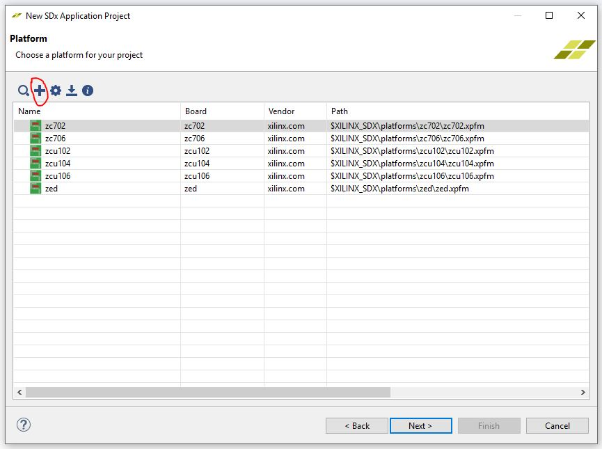
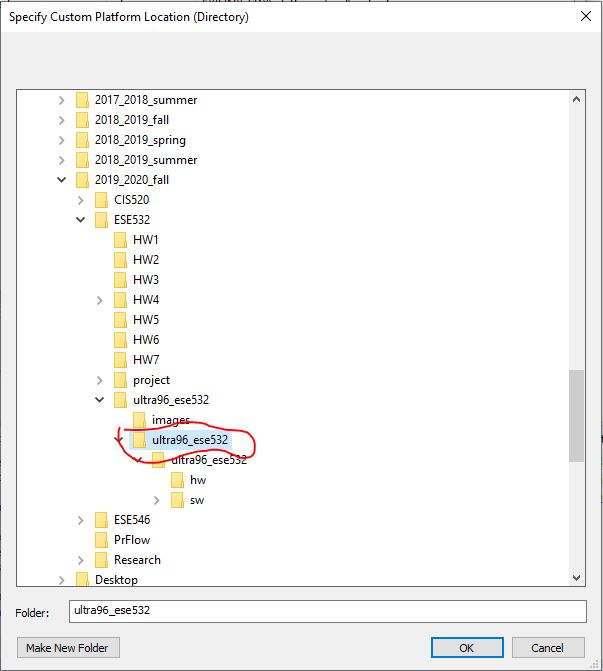
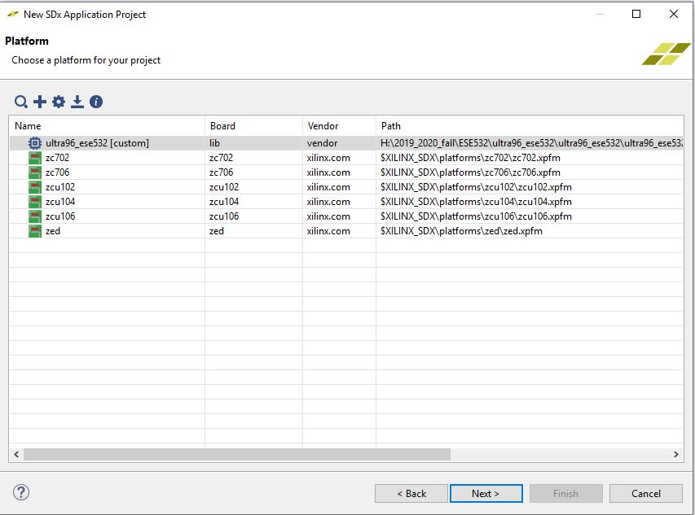
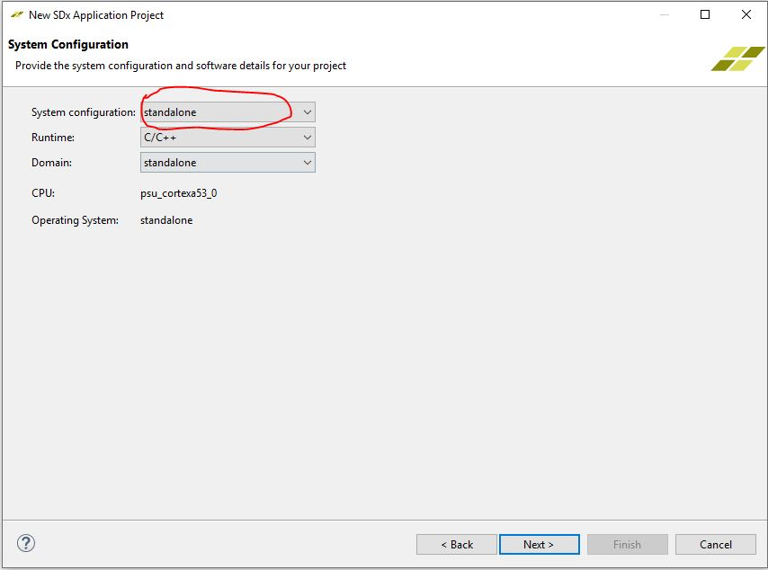
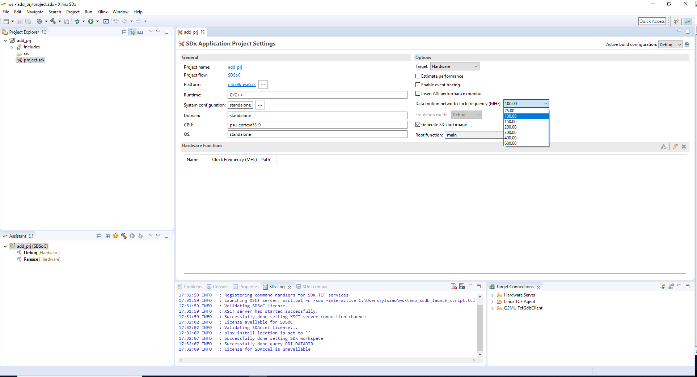

# ultra96_ese532
This repo is to show you how to use the platform created by us.

## Motivation

The platform released in the [official website]( http://ultra96.org/support/design/24166/156) has limited clock options to choose, which may affect your project performance. You can download the platform from [here](http://www.seas.upenn.edu/~ese532/fall2019/code/ultra96_ese532.tar.gz), or clone our repo, the platform is under [/ultra96_ese532](/ultra96_ese532).
 ## How to integrate the new platform
 Extract the platform file. Open SDx 2018.3, and create a new application project. When choosing platform, click add.
 

Choose the right location for the platform, and click "OK".

You will see the new platform is in you platform repo.

Choose `standalone` for the `System configuration` and finish.

Now you can see you have more clock options to choose. We usually choose `200MHz` for the newtwork.

